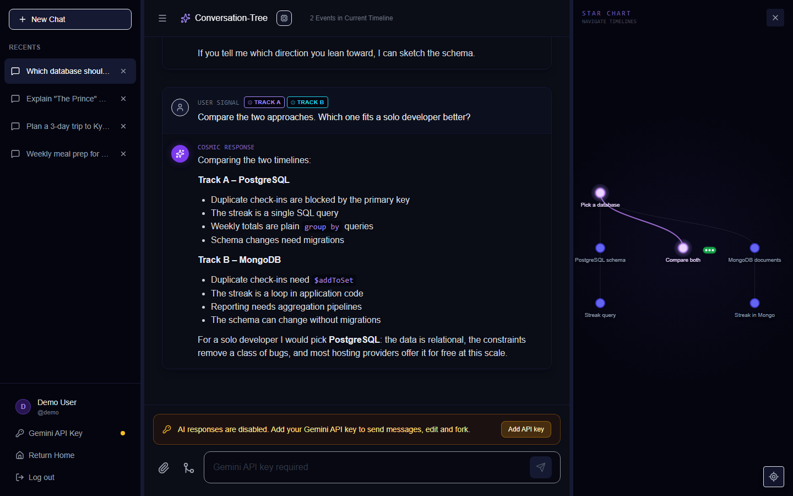
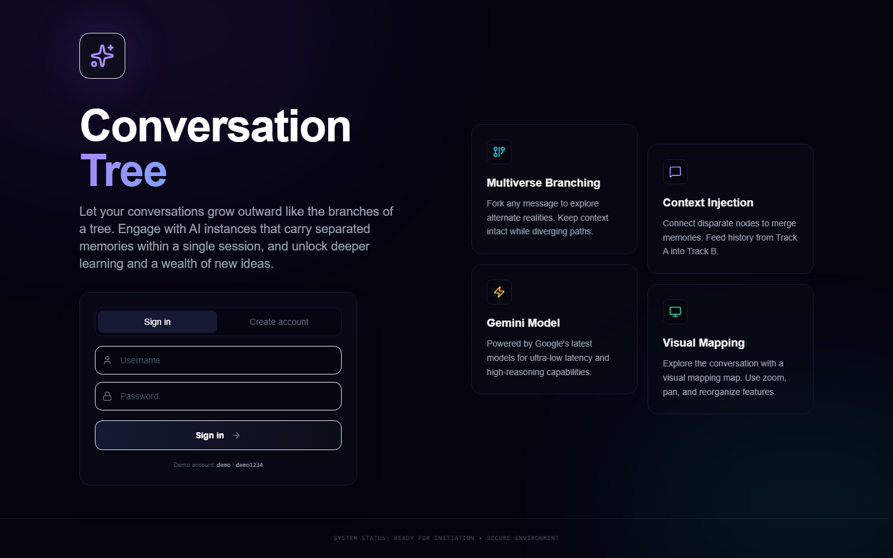
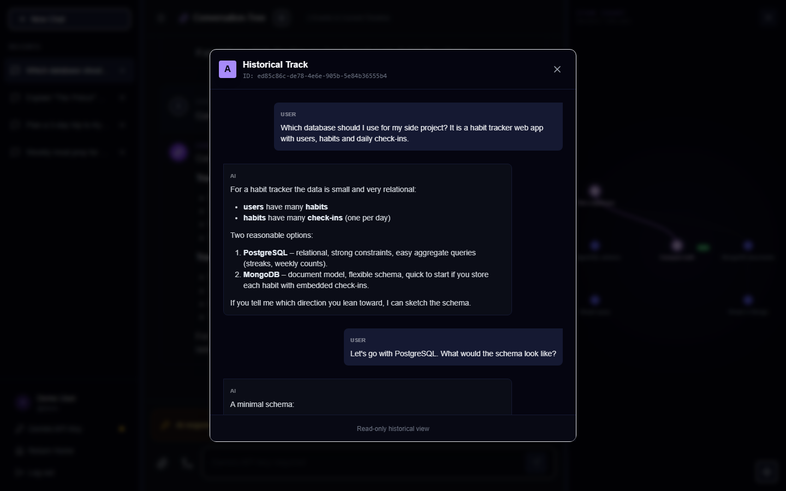
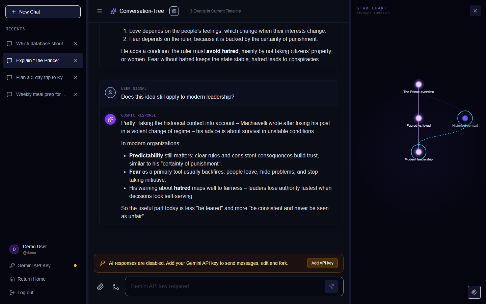
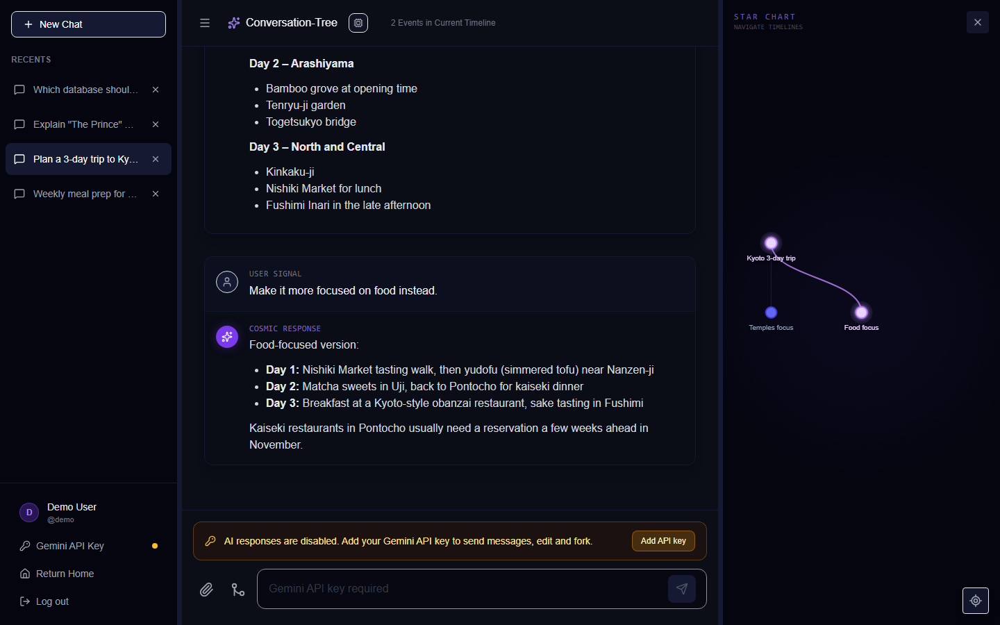
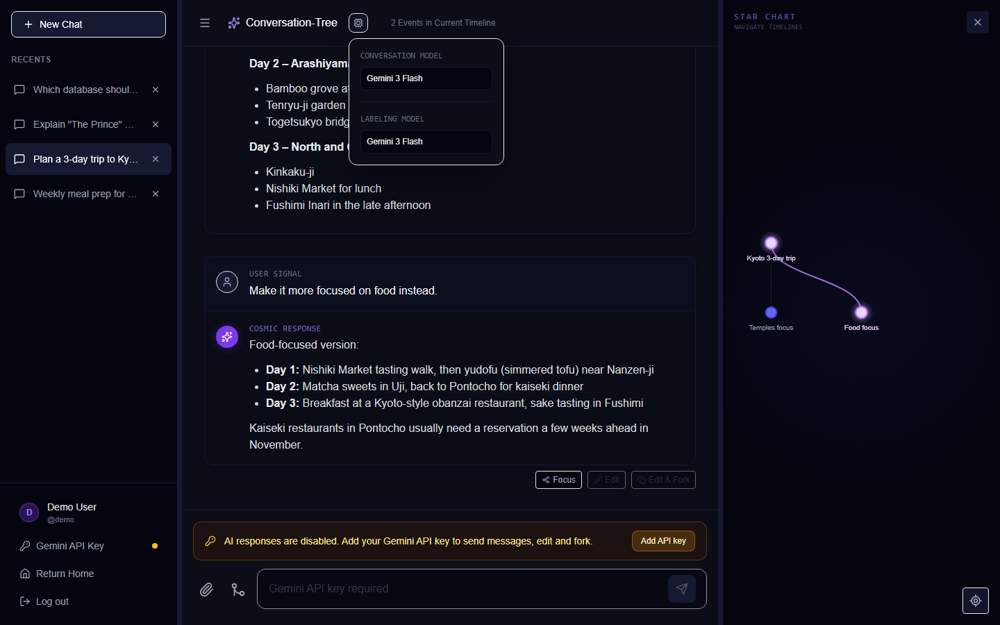
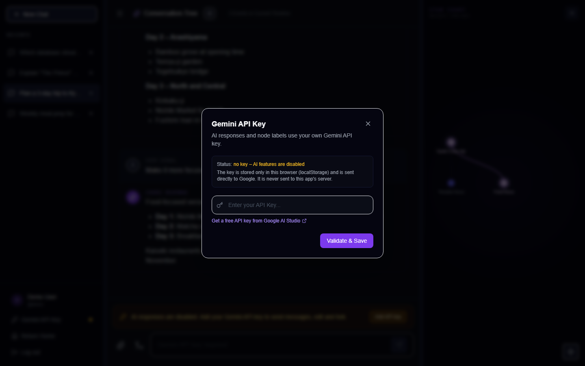

# 🌳 Conversation-Tree

**メッセージごとに会話を枝分かれさせ、その構造をツリーマップで表示するチャットインターフェースです。**

[](https://opensource.org/licenses/MIT) [](https://www.typescriptlang.org/) [](https://react.dev/) [](https://vitejs.dev/) [](https://expressjs.com/) [](https://www.postgresql.org/) [](https://www.docker.com/)

[English](README.md) | [한국어](README.ko.md) | **日本語** | [中文](README.zh.md) | [Español](README.es.md)

[](https://ai.google.dev)

---

## 💭 Developer's Note

> *「単なる線形の記録ではなく、無限に分岐する可能性の会話です。」*

<!-- TODO: 개발 동기 -->

---

## ✨ Features

### 🌳 会話の分岐
- ユーザーのメッセージとAIの回答を `parentId` / `childrenIds` を持つノードとして保存するため、1つの会話がツリーになる
- **Focus** で以前の回答を現在位置（head）にすると、次のメッセージはそこから新しい枝として続く
- **Edit** は質問を置き換えて回答を再生成し、**Edit & Fork** は元の質問を残したまま、編集した質問を兄弟の枝として追加する
- AIにはルートから現在のheadまでの経路上のメッセージだけが送られる

### 🔗 記憶の接続
- **Connect Memory** で別の枝のノードを現在の枝に接続する
- 送信時、接続した枝のメッセージ（共通の祖先以降）を「Connected Memory」ブロックとしてプロンプトの前に付ける
- 接続はマップ上に点線で表示され、**Delete Connection** で解除できる

### 📊 タイムライン比較
- 比較ボタンでトラック選択モードに切り替え、マップの末端ノードを Track B, C, … として選ぶ
- 選択した各トラックの会話全文が質問にコンテキストとして追加される
- 添付されたトラックはメッセージにバッジで表示され、読み取り専用の画面で開ける

### 🗺️ 会話マップ
- チャットの横に質問/回答のペアを D3.js のツリーで表示
- ズーム、パン、ノードのドラッグ、現在ノードへの再センタリングに対応。ドラッグした位置は保存される
- ノード名は Gemini が生成した短い要約（キーがない場合は質問の先頭の単語）

### ⚡ Gemini の回答
- `@google/genai` でブラウザから直接呼び出し、回答をストリーミングで表示
- 回答用とラベル用のモデルを Gemini 3 Flash / Pro からそれぞれ選択
- 画像の添付（ファイル選択または貼り付け）は inline data として送信

### 👤 アカウントと保存
- ユーザー名とパスワードによる登録・ログイン（bcrypt ハッシュ、httpOnly Cookie に JWT）
- 会話、選択中の会話、モデル選択をユーザーごとに PostgreSQL に保存
- ストリーミングのチャンクごとには保存せず、変更された会話だけを一定間隔で送信

---

## 🚀 Getting Started

### Prerequisites
- [Docker](https://docs.docker.com/get-docker/) と Docker Compose
- （任意、AI回答用）[Google Gemini API キー](https://aistudio.google.com/apikey)

### 実行

```bash
git clone https://github.com/Zanviq/Conversation-Tree.git
cd Conversation-Tree
cp .env.example .env
docker compose up
```

http://localhost:8080 を開きます（ポートが使用中の場合は `.env` の `WEB_PORT` を変更）。

初回起動時にサーバーがDBマイグレーションを適用し、サンプル会話入りのデモアカウントを作成します。

### デモアカウント

| ユーザー名 | パスワード |
|----------|----------|
| `demo` | `demo1234` |

### Gemini API キー
キーがなくてもログインして、すべての会話、マップ、トラック画面を閲覧できます。送信、**Edit**、**Edit & Fork** はキーを入力するまで無効になります。

1. 入力欄の上の **Add API key**（またはサイドバーの **Gemini API Key**）をクリック
2. キーを貼り付けて **Validate & Save** をクリック
3. キーはブラウザの localStorage にのみ保存され、Google に直接送信される。このアプリのサーバーには送信されない

---

## 🛠️ Tech Stack

| Category | Technology |
|----------|-----------|
| **Frontend** | React 19, TypeScript, Vite 6 |
| **Visualization** | D3.js 7 |
| **Styling** | Tailwind CSS |
| **Markdown** | react-markdown |
| **AI** | Google Gemini API（`@google/genai`、ブラウザから呼び出し） |
| **Backend** | Node.js 22, Express 5 |
| **Database** | PostgreSQL 16, Drizzle ORM, drizzle-kit |
| **Auth** | bcryptjs, jsonwebtoken（httpOnly Cookie） |
| **Infra** | Docker Compose, nginx |
| **Screenshots** | Playwright |

---

## 📁 Project Structure

```
Conversation-Tree/
├── 📂 components/
│   ├── ChatInterface.tsx       # 会話スレッド、メッセージ操作、入力欄、APIキーの案内
│   ├── UniverseMap.tsx         # D3 会話マップ（ドラッグ、ズーム、接続、トラック）
│   ├── LandingPage.tsx         # ランディングページとログイン/登録
│   └── ApiKeyModal.tsx         # Gemini API キー入力（ブラウザにのみ保存）
├── 📂 services/
│   ├── apiClient.ts            # fetch ラッパーと認証API呼び出し
│   ├── apiKeyStore.ts          # localStorage の Gemini キー管理
│   ├── geminiService.ts        # ストリーミング回答、キー検証、ノードラベル
│   └── storageService.ts       # 会話・設定をサーバーと同期
├── 📂 utils/
│   └── graphUtils.ts           # スレッド構築、記憶の接続、ツリー階層への変換
├── 📂 server/
│   ├── 📂 drizzle/             # SQL マイグレーション
│   ├── 📂 src/
│   │   ├── 📂 db/              # スキーマ、マイグレーション実行、デモ seed
│   │   ├── 📂 routes/          # /api/auth, /api/conversations, /api/settings
│   │   ├── auth.ts             # パスワードハッシュとセッションCookie
│   │   └── index.ts            # Express エントリ（マイグレーション → seed → 起動）
│   └── Dockerfile
├── 📂 docker/
│   └── nginx.conf              # Web ビルドの配信と /api のプロキシ
├── 📂 scripts/
│   └── 📂 capture-screenshots/ # README スクリーンショット用 Playwright スクリプト
├── 📂 image/                   # スクリーンショット
├── App.tsx                     # アプリの状態、分岐ロジック、レイアウト
├── types.ts                    # Session / Message の型
├── Dockerfile                  # Web イメージ（Vite ビルド → nginx）
├── docker-compose.yml          # db, server, web
└── .env.example
```

---

## 💡 How to Use

1. **ログイン**: ランディングページでデモアカウントでログインするか、アカウントを作成
2. **会話を始める**: **New Chat** を押してメッセージを送信（Gemini API キーが必要）
3. **分岐**: 回答にマウスを乗せて **Focus** を押すか、マップのノードをクリック → **Focus / View** の後、新しいメッセージを送信
4. **Edit & Fork**: 以前の質問を編集し、両方のバージョンを別々の枝として残す
5. **記憶の接続**: ノードをクリック → **Connect Memory** → 対象ノードを選択
6. **タイムライン比較**: 入力欄の横の比較ボタンを押し、マップで末端ノードを選んでから質問
7. **マップの整理**: ノードをドラッグすると、位置が会話と一緒に保存される

---

## 🎨 Screenshots

<p align="center">
  
</p>

<table>
  <tr>
    <td align="center"><br><sub>ランディング / ログイン</sub></td>
    <td align="center"><br><sub>読み取り専用のトラック表示</sub></td>
  </tr>
  <tr>
    <td align="center"><br><sub>記憶の接続</sub></td>
    <td align="center"><br><sub>分岐マップ</sub></td>
  </tr>
  <tr>
    <td align="center"><br><sub>モデル選択</sub></td>
    <td align="center"><br><sub>Gemini API キー設定</sub></td>
  </tr>
</table>

---

## 📝 License

MIT License. 詳細は [LICENSE](LICENSE) をご覧ください。

| 👤 Developer | ✉️ Email |
|:---:|:---:|
| Zanviq | zanviq.dev@gmail.com |
