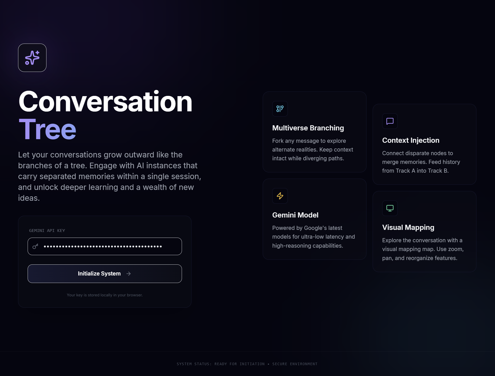
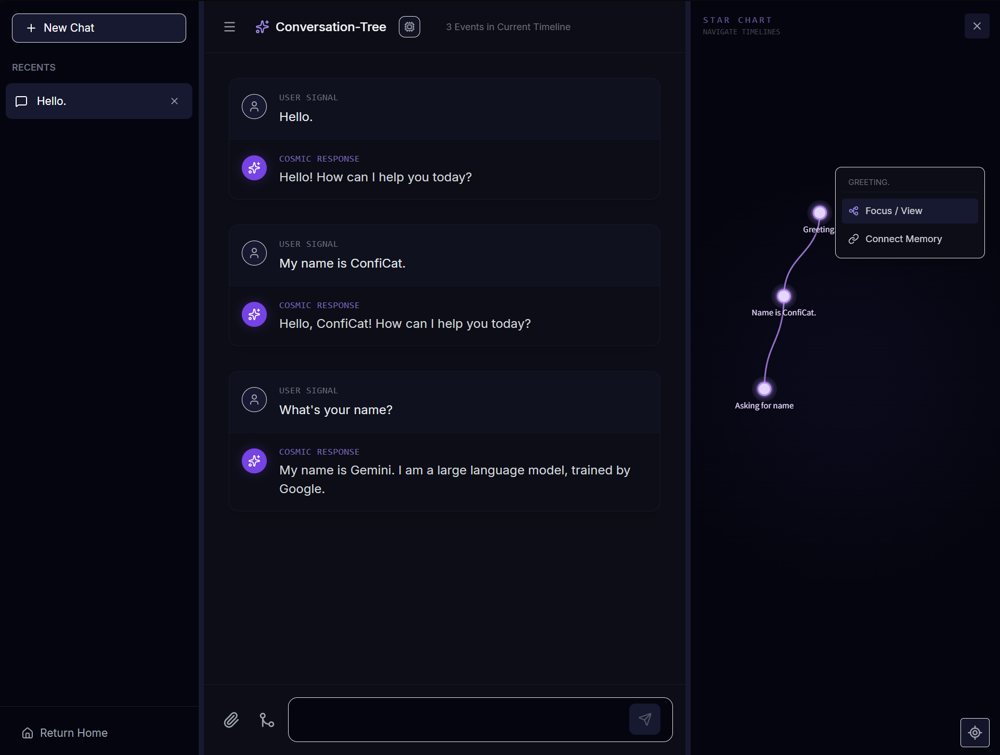
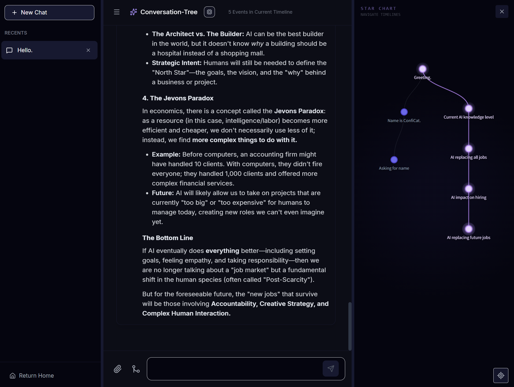
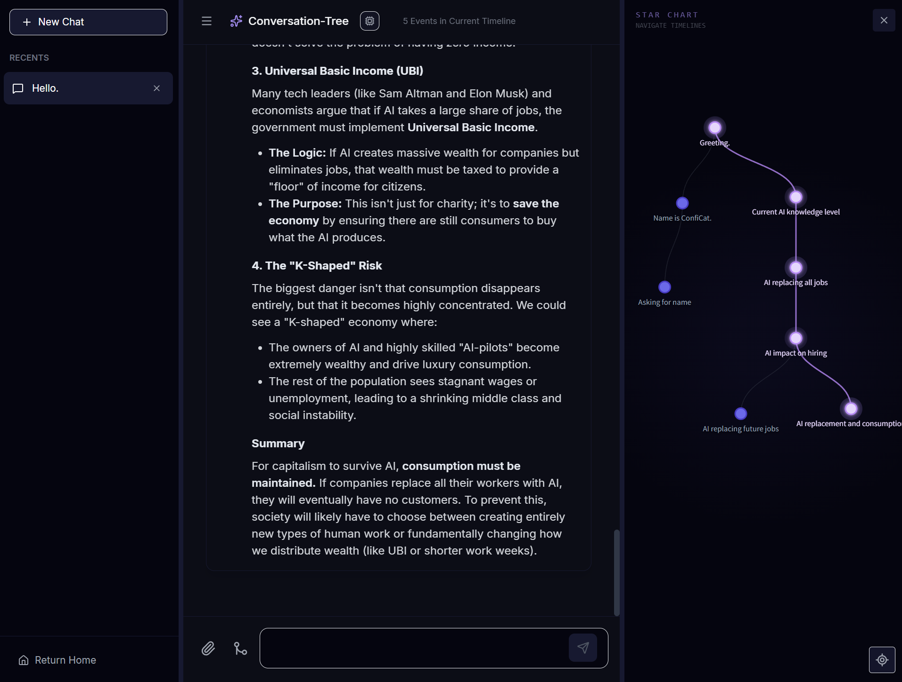
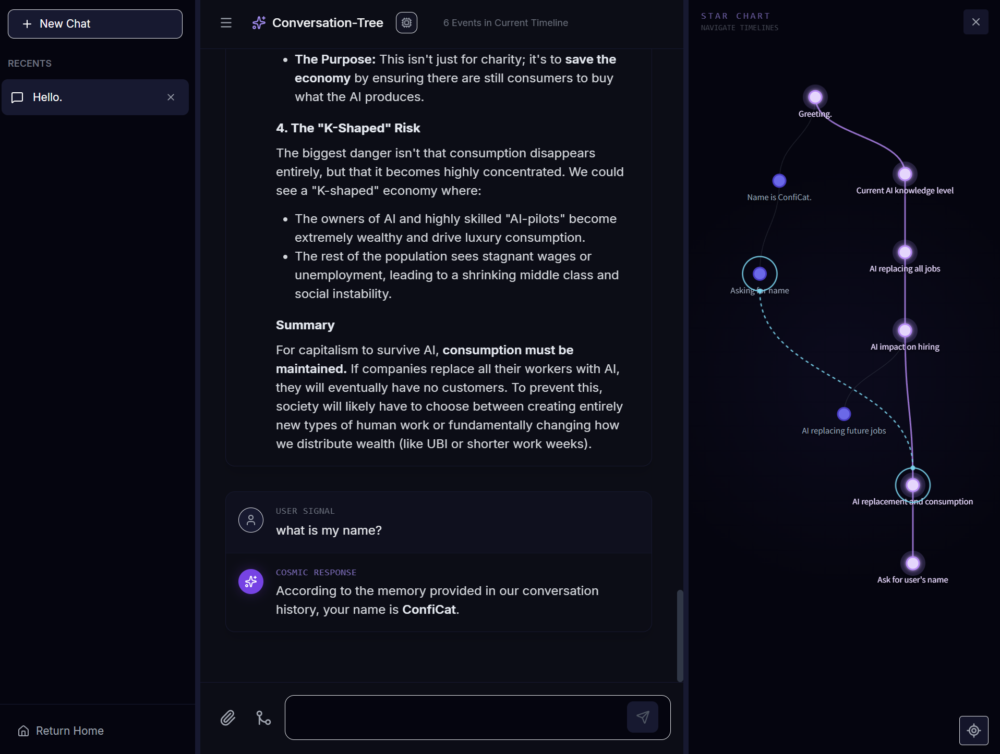

<div align="center">

# 🌳 Conversation-Tree

**대화를 트리처럼 탐험하세요**

[](https://opensource.org/licenses/MIT)
[](https://www.typescriptlang.org/)
[](https://reactjs.org/)
[](https://vitejs.dev/)

[English](./README.md) | [日本語](./README.ja.md) | **한국어** | [中文](./README.zh.md) | [Español](./README.es.md)


</div>

---

## 💭 프로젝트 소감

> *"단순한 선형 기록이 아니라, 무한히 분기하는 가능성의 대화입니다."*

우리의 일상에서 대형 언어 모델은 많은 지식을 전달해 줍니다. 특히 평소에 궁금한게 많던 저는 구글 검색 대신 구글 AI에게 많은 질문을 합니다. 거의 모든 인공지능 사이트에서는 *"대화방"* 을 많이 사용합니다. 물론 이는 우리가 하나의 주제에 대해서 집중적으로 인공지능에게 물어볼 수 있는 좋은 기회를 제공합니다. 그러나 저는 이 부분에서 약간의 부족함을 느꼈고, 그 부족함이 불편함으로 다가왔습니다.

특히 인공지능은 한번에 많은 정보를 저에게 제공하려고 합니다. 예를 들어 1. 2. 3. 과 같이 번호를 붙여 설명하면 저는 1번에 대해서 질문을 이어가다가, 다시 2번으로 돌아가야하는 경우에 난처해집니다.

이전에 저는 인공지능의 부족한 장기 기억을 보완하고자 "계층적 의미 기억 시스템"이라는 아이디어를 떠올리고, 제작해본 경험이 있었습니다. 아이디어를 확장하여, 이 프로젝트에서는 **기억을 트랙별로 분리하고 원하는 기억에서 대화를 할 수 있도록** 대화방을 제작하고자 했습니다.

그래서 저는 아래와 같은 프로젝트를 기획했습니다.
많은 사람들이 이 기능을 사용해 주었으면 좋겠으며, 이 프로젝트는 따로 호스팅하여 제공하지 않습니다.

---

## ✨ 주요 기능

### 🌳 멀티버스 브랜칭
- 어떤 메시지에서든 새로운 대화 분기 생성
- 모든 분기의 컨텍스트가 독립적으로 유지
- "Edit & Fork" 기능으로 과거 질문 수정 후 새 경로 탐색

### 🔗 메모리 연결 (Context Injection)
- 서로 다른 대화 경로 간 메모리 공유
- Track A의 컨텍스트를 Track B에 주입
- 복잡한 아이디어의 교차 참조 가능

### 🗺️ 인터랙티브 트리 지도
- D3.js 기반 실시간 대화 시각화
- 드래그로 노드 위치 자유롭게 조정
- 줌/팬으로 전체 대화 구조 탐색
- 현재 위치로 자동 리센터링

### ⚡ Gemini 3 통합
- Google Gemini 3 Flash/Pro 모델 지원
- 실시간 스트리밍 응답
- 이미지 첨부 및 멀티모달 대화

### 📊 트랙 비교 모드
- 여러 대화 경로를 동시에 선택
- AI가 선택된 트랙들을 비교 분석
- 병렬 타임라인 탐색

---

## 🚀 시작하기

### 사전 요구사항
- Node.js 18+
- [Google Gemini API Key](https://aistudio.google.com/app/apikey)

### 설치

```bash
# 저장소 클론
git clone https://github.com/your-username/Conversation-Tree.git
cd Conversation-Tree

# 의존성 설치
npm install

# 개발 서버 실행
npm run dev
```

### 빌드

```bash
# 프로덕션 빌드
npm run build

# 미리보기
npm run preview
```

### API 키 설정

1. 앱 실행 시 Landing Page에서 Gemini API Key 입력
2. 키는 브라우저 로컬 스토리지에 안전하게 저장
3. 다음 접속 시 자동 로드

---

## 🛠️ 기술 스택

| 분류 | 기술 |
|------|------|
| **Frontend** | React 19, TypeScript |
| **Visualization** | D3.js 7 |
| **Styling** | Tailwind CSS |
| **AI** | Google Gemini API |
| **Build** | Vite |
| **Markdown** | react-markdown |

---

## 📁 프로젝트 구조

```
conversation-tree/
├── 📂 components/
│   ├── ChatInterface.tsx    # 채팅 UI 및 메시지 렌더링
│   ├── UniverseMap.tsx      # D3.js 기반 대화 시각화
│   └── LandingPage.tsx      # API 키 입력 및 온보딩
├── 📂 services/
│   ├── geminiService.ts     # Gemini API 통합
│   └── storageService.ts    # 로컬/브라우저 저장소 관리
├── 📂 utils/
│   └── graphUtils.ts        # 그래프 순회 및 트리 구축
├── 📂 conversation-tree-data/     # 세션 데이터 (자동 생성)
├── App.tsx                  # 메인 앱 컴포넌트
├── types.ts                 # TypeScript 타입 정의
└── vite.config.ts           # Vite 설정 및 API 플러그인
```

---

## 💡 사용 방법

1. **새 대화 시작**: 좌측 사이드바에서 "New Chat" 클릭
2. **분기 생성**: 우주 지도에서 노드 클릭 → "Focus / View" 선택 후 새 메시지 입력
3. **메모리 연결**: 노드 클릭 → "Connect Memory" → 연결할 노드 선택
4. **트랙 비교**: 하단 GitMerge 아이콘 클릭 → 비교할 리프 노드 선택 → 질문 입력
5. **레이아웃 조정**: 노드를 드래그하여 원하는 위치로 이동 (자동 저장)

---

## 🎨 스크린샷

<div align="center">
<i>간단한 예시 스크린샷 입니다.</i>



<table>
  <tr>
    <td></td>
    <td></td>
  </tr>
  <tr>
    <td></td>
    <td></td>
  </tr>
</table>
</div>

---

## 📝 라이선스

이 프로젝트는 MIT 라이선스로 배포됩니다. 자세한 내용은 [LICENSE](LICENSE) 파일을 참조하세요.

---

<div align="center">

**⭐ 이 프로젝트가 도움이 되었다면 Star를 눌러주세요! ⭐**

</div>


> Google, OpenAI, Claude, XAI, Grok....외에도 많은 AI 스타트업 개발자분들이 이 기능을 추가해주시면 매우 유용하게 사용할 것 같습니다.

<div align="center">

| 👤 **개발자** | ✉️ **이메일** |
|:---:|:---:|
| Zanviq | Zanviq.dev@gmail.com |

</div>
